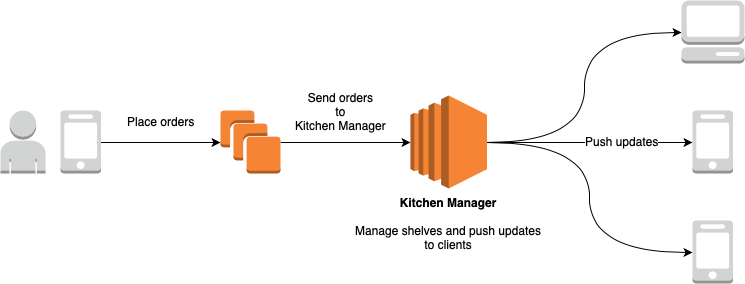
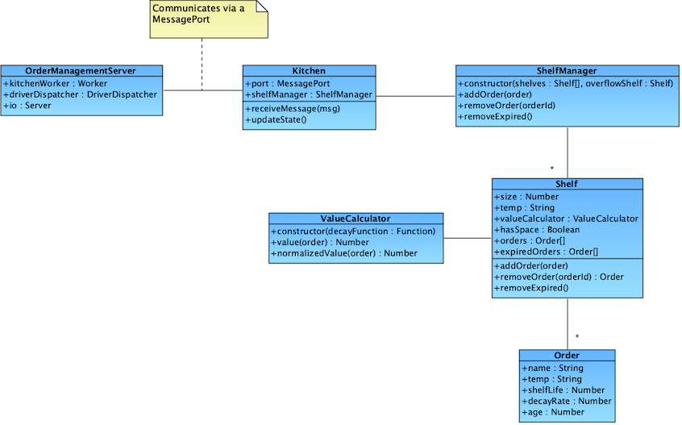
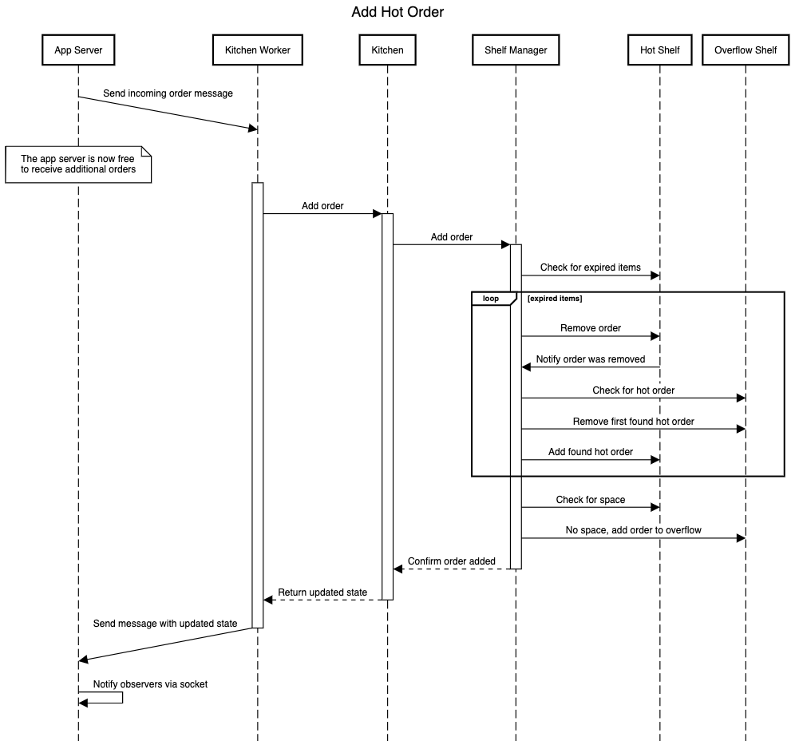

# System Overview for Welcome
This is a sample of my writing for a proof of concept system I wrote. I'm unable to make the relevant code available, unfortunately. Combine that with the lack of a domain description and it may be a little harder to follow than it was for the intended audience. However, I believe it accurately  portrays my writing and communication style. Enjoy!

## Running the code
Docker is the preferred way to run this code.
```bash
docker-compose up -d
open http://localhost:8000
```

Alternatively, it can be run directly from Node (tested on v11.14 and v12.4).
```bash
npm install
npm start
open http://localhost:8000
```
In the web page, click **"Open for business"** in the upper right corner to begin the simulation.

## System Overview
The system is built with Node. While I (love to) write Ruby all day, I wanted to leverage
[CSP](https://en.wikipedia.org/wiki/Communicating_sequential_processes) for concurrency. The CSP
implementation in [concurrent-ruby](https://github.com/ruby-concurrency/concurrent-ruby) is still a
work in progress, thus my familiarity with Node combined with its worker thread model was a good fit.

The system is comprised of a server that receives orders via socket, processes the order, and sends
updated state out to one or more clients via a socket. The socket communication leverages
[socket.io](https://github.com/socketio/socket.io) for both the server and client.

A simple client is also provided for visualizing the state of the shelves and orders.



## Implementation
The state of shelves changes frequently and is triggered by [multiple messages](#change-messages). As
the shelves are modeling their physical counterparts, they reflect a shared state and thus
concurrent access must be controlled to prevent incompatible changes from occurring.


> ### On concurrency
>To illustrate why controlling concurrency is important, here's a simple example. Some fries are
removed from the hot shelf. The overflow shelf is checked for a hot order to move to the hot shelf.
It has a juicy veggie burger, which we'll now move to the hot shelf. While the burger is in transit
to its new home, a new hot order has been fulfilled and took up the free space. And before we can
replace the burger order back on the overflow shelf, a new order was fulfilled that took up that space.
This delicious veggies burger is now without a home. Chaos ensues.

A primary goal of this implementation is to make state management and the flow of change simple to
reason about. In doing so, it's harder for developers (including the author's future self) to
inadvertently introduce bugs and leads to easier testing.

The approach uses [Communicating Sequential Processes (CSP)](https://en.wikipedia.org/wiki/Communicating_sequential_processes)
leveraging Node's [worker threads](https://nodejs.org/api/worker_threads.html). Changes are
triggered outside of the Kitchen, which controls access to the Shelves. These changes happen in
order and one at a time. Shelving changes (e.g. adding an order) requested during the execution of
a change will be queued.

The Kitchen itself lives within a worker thread, which provides the mechanism for this access.
Requested changes are executed one at a time within the worker thread with additional changes
automatically queuing up and waiting until the worker's execution thread frees up before the next
message is executed.

Note that additional changes *can* and *do* happen within the Kitchen's worker thread, such as
moving items from the overflow shelf to a temperature controlled shelf when an order is picked up.
However, they are *always* in response to a passed message. This means, for instance, that running
a timer within the thread that checks for expired items is not allowed. While it's possible to
implement correctly, it's harder to reason about the correctness of it. All changes *must* be
triggered from outside the Kitchen.

Any state changes that occur within the kitchen are then communicated back out as a single, complete
state. This is in contrast to communicating each change or batch of changes, which would require
state management by any receivers of the data so they can apply the changes correctly. This
results in additional complexity for each client and leads to challenges for error recovery. By
sending each state in its entirety, missed messages will be auto-recovered from in the next
state change. Additionally, disconnected clients can reconnect and immediately be given the full
state rather than a series of changes. This approach integrates nicely with frameworks such as
Vue.js and React.


## Change Messages
### `incomingOrder`
This message represents a new order that has come in and should be processed by the kitchen.
Note that as orders are received, a check for expired orders will occur and the shelves will be
rebalanced in the event that expired orders are found and removed. This ensures orders that come
in between expiration checks will never lose space to an order that expired after the last check.

### `checkForExpirations`
This message instructs the kitchen to check for and remove any expired items. Learn more
[here](#expiration).

### `orderPickup`
This message instructs the kitchen to remove an order from the kitchen when a driver comes to
pickup an order.


## Shelf management
Logic around which orders go on which shelves is encapsulated in a shelf manager. The current shelf
manager, `OverflowShelfManager`, will place orders on the correct temperature controlled shelf. In
the event that the correct shelf has no more space, the order will be placed on a non-temperature
controlled overflow shelf.

Should space on a temperature controlled shelf free up, the `OverflowShelfManager` will move any
applicable orders from the overflow shelf to their correct shelf.

Internally, shelf management happens one order at a time. That is, if three orders are marked
expired at the same time they are removed serially. As each is removed, the shelf manager is notified
(synchronously) and applies the appropriate logic. After which, the next order is removed, and so on.
This simplifies the flow of logic internally. *However*, the change of state will then be
communicated outward in a single message all at once. 


## Expiration
Expiration of orders happens at two different times: On a per-second cycle (as shelf life is
measured in seconds) and when orders are placed. As orders can be received between sweeps, an
order that wasn't expired 300ms ago may be now. We never want to lose shelf space to an expired
order. The idea of tossing a hot, crisp slice of pizza because of some old, soggy fries hurts my
heart.

To avoid doing expiry sweeps more than we need to, a received order will delay the next
sweep by one second. Thus instead of:
 ```
 sweep -(300ms)-> order received (sweep) -(700ms)-> sweep
 ```
the flow is:
```
sweep -(300ms)-> order received (sweep) -(1000ms)-> sweep
```

When an item is expired, it will be removed from its shelf and if necessary the shelf will be
rebalanced with an item from the overflow shelf. The app will be notified by the kitchen of the
expiration and the driver will be notified that the order was cancelled.

>### On timers
> An alternative to expiry sweeps would be to set a timer for each item as to when it will expire.
The first decision to make is are the timers kept within the Kitchen or outside of the Kitchen.
>
>If kept outside the Kitchen, an additional layer of state management has been introduced as these 
timers can be prematurely cancelled (e.g. when an order is picked up). For scalability, it may be
worth moving in this direction if the expiry sweep becomes too inefficient. Howeer, actual expiration
is also based on value, not strictly shelf life and the timers would result in one expired order at
a time being removed per message/cycle rather than all expired items in one sweep.
>
> If the timers are running inside of the Kitchen, we now introduce internally triggered state
changes within the worker thread which make the flow of change more difficult to reason about.


## Scalability
The current implementation scales vertically per Kitchen, horizontally across Kitchens. A single
server can handle multiple Kitchens by executing each Kitchen within its own worker thread.

If a higher level of horizontal scalability becomes necessary, this same pattern (and much of the code),
can be leveraged by swapping out Node worker threads for a FIFO queuing system. AWS SQS queues or
AWS Kinesis combined with Lambda functions are apt candidates here. By partitioning the data by
Kitchen (via group ID or partition key in those technologies), multiple kitchens can be processed
concurrently while each kitchen is processed serially, maintaining the same safeties and simplicity
of logic in this code.


## Resiliency

The system currently keeps things in memory, thus there is no resiliency should the state of the
kitchen be lost. Were this to go into production, each state change would be pushed out to a
persistence layer by the Kitchen. This allows each Kitchen thread to persist changes without blocking
the main server thread or each other. This state would be read in at startup to recover the last
known state in the event of a crash.


## Classes



### Order
Order is a simple data object.

### Value Calculator
A Value Calculator is used to determine the value of each order at any point in time. The value
determines whether the order is expired. Each value calculator can take a function that is used
to calculate the value.

### Shelf
Shelves contain orders. The functionality is straightforward. Of note, each Shelf can check for
expired orders and remove them.

Shelves are EventEmitters. Observers can be notified of items being added, removed, and expired.

### Shelf Manager
The Shelf Manager is responsible for coordinating adding and removing orders from the shelves. The
Overflow Shelf Manager considers whether shelves have free space, placing orders on the overflow
shelf if necessary. Likewise, it will shuffle overflow orders to the appropriate shelf as space
frees up. It observes changes to each shelf under its control to understand when space frees up.

Shelf managers are EventEmitters. Observers can be notified of "orderWasted", "orderAdded",
"orderRemoved", and "orderExpired" events.

### Kitchen
The Kitchen manages communication between the server and the shelf manager. It receives messages
from the server via a MessagePort, translating those into actions. It acts as an observer to the
shelf manager, listening for changes.

Changes to shelves are always triggered from the server. The shelf manager will then perform work
and notify the kitchen. Then kitchen then passes the updated state to the server.

### Order Management Server
The Order Management Server receives orders via a socket, talks to the kitchen, and communicates
state back out to clients.


## Example Data Flow

